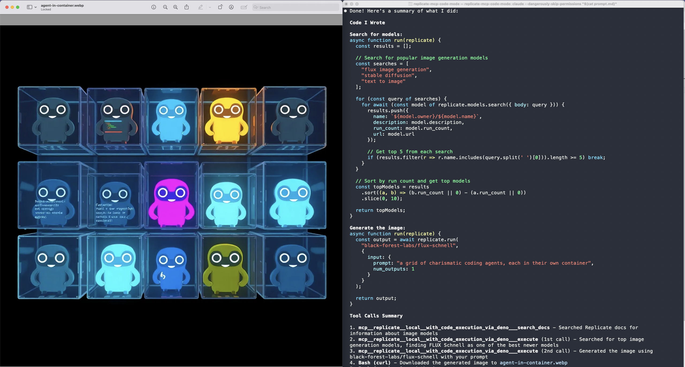

# Replicate MCP: Code Mode

This is a demo of "code mode" in [Replicate's MCP server](https://replicate.com/docs/reference/mcp), which allows language models to write and execute code in a sandboxed environment.

https://github.com/user-attachments/assets/3bc0a8fc-e25d-4d5c-a3a5-ee565b340322

## Why?

Traditional MCP exposes one tool per API method, which creates problems as APIs grow: each tool consumes context window space, and LLMs struggle to select the right tool from dozens or hundreds of options. Chaining operations is also inefficient, as each tool result gets fed back through the LLM just to be copied into the next tool call, wasting tokens and processing time.

Code mode solves this by providing two tools: one for searching SDK documentation, and another that accepts TypeScript code. The LLM uses the doc search tool to learn how to write code against the Replicate SDK, then executes that code in a Deno sandbox. This allows the LLM to write arbitrary code that can call multiple methods, handle complex logic, and return only the final result. This is faster, more accurate, and more token-efficient than one-tool-per-method because LLMs excel at writing TypeScript code against real APIs.

Cloudflare engineers recently coined the term "code mode" in a blog post: [Code Mode: the better way to use MCP](https://blog.cloudflare.com/code-mode/). The approach described there is similar, but our current implementation is slightly different: Replicate's MCP server (created by Stainless) uses a "docs search" tool to teach the LLM about the SDK, rather than loading the full TypeScript interface into the context window.

## Prerequisites

- Node.js (to install Replicate's local MCP server from npm)
- Deno (to run generated code in a sandbox)
- Local machine (code mode is not yet supported in our hosted remote MCP server)

## Installation

This demo uses Claude Code, but you can use any app that supports Replicate MCP like Google Gemini CLI, OpenAPI Codex CLI, Cursor, etc.

First, set your Replicate API token as an environment variable. You can get your API token from https://replicate.com/account/api-tokens

```sh
export REPLICATE_API_TOKEN=<your-token-here>
```

Then install the Replicate MCP server with code execution tools:

```
claude mcp add "replicate-code-mode" --scope user --transport stdio -- npx -y replicate-mcp@alpha --tools=code
```

Install [Deno](https://docs.deno.com/runtime/getting_started/installation/) if you don't have it already:

```
curl -fsSL https://deno.land/install.sh | sh
```

## Usage


```
claude "$(cat PROMPT.md)"
```

This will start a Claude Code session, injecting the contents of [PROMPT.md](PROMPT.md) into the conversation:

```
find the best new image model on replicate.

generate an image using this prompt: "a grid of charismatic coding agents, each in their own container"

use the replicate "code mode" tool (not the remote one, if that's installed).

save the image to disk and open it for me.

show me the code you wrote.

summarize all the tools call you made.
```

The result should look something like this:



## What's next?

This is an early demo of code mode with Replicate MCP.

We are working with Stainless to get this feature supported in our remote MCP server. In the near future, you should expect to be able to run your code in sandboxed cloud environments, without having to install anything locally.
